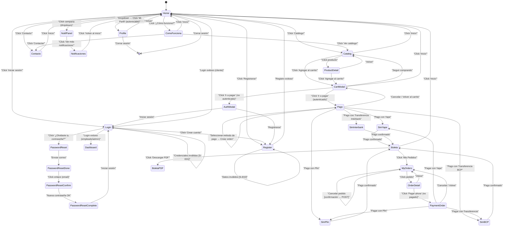
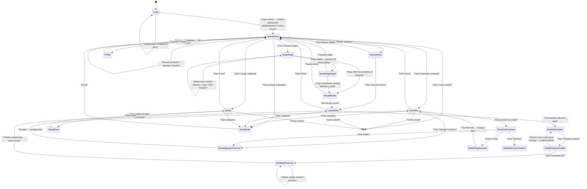

# Análisis de Diagrama de Transición de Diálogo
## Proyecto: Minimarket Yumis — Sistema de Pedidos

**Metodología aplicada:** Análisis de tareas basado en el código fuente real (Django 6.0 + Alpine.js + Tailwind CSS). Se recorrieron los 5 módulos del proyecto (`core`, `accounts`, `products`, `orders`, `payment_simulation`), identificando todas las rutas (`urls.py`), vistas (Python), componentes frontend (Alpine.js) y templates (HTML) que materializan cada pantalla y transición.

---

## 1. Diagrama de Transición de Diálogo — ROL CLIENTE

### Nodos (pantallas/vistas) identificados

| # | Nodo | Ruta URL | Archivo(s) que lo implementan |
|---|------|----------|-------------------------------|
| S0 | Home (Landing) | `/` | `core/views.py:89` → `templates/core/home.html` |
| S1 | Catálogo | `/catalogo/` | `apps/products/views.py` → `templates/products/catalog.html`, `static/.../catalog.js` |
| S2 | Detalle de Producto | `/catalogo/<slug>/` | `apps/products/views.py` → `templates/products/product_detail.html`, `static/.../productDetail.js` |
| S3 | ¿Cómo funciona? | `/como-funciona/` | `core/views.py:94` → `templates/core/como_funciona.html` |
| S4 | Contacto | `/contacto/` | `core/views.py:98` → `templates/core/contacto.html`, `static/.../contact.js` |
| S5 | Login | `/cuenta/ingresar/` | `apps/accounts/views.py:13` → `templates/accounts/login.html` |
| S6 | Registro | `/cuenta/registrarse/` | `apps/accounts/views.py:38` → `templates/accounts/register.html` |
| S7 | Perfil | `/cuenta/perfil/` | `apps/accounts/views.py:67` → `templates/accounts/profile.html`, `static/.../profile.js` |
| S8 | Carrito (pantalla completa) | `/carrito/` | `apps/orders/views/cart_views.py:46` → `templates/orders/cart.html` |
| S9 | Carrito (modal overlay) | — (navbar) | `templates/core/_cart_modal.html`, `static/.../navbar.js:115` |
| S10 | Pago | `/pago/` | `apps/orders/views/cart_views.py:32` → `templates/orders/pago.html`, `static/.../pago.js` |
| S11 | Mis Pedidos | `/pedidos/` | `apps/orders/views/order_views.py:13` → `templates/orders/my_orders.html`, `static/.../myOrders.js` |
| S12 | Detalle de Pedido | `/pedidos/<id>/` | `apps/orders/views/order_views.py:43` → `templates/orders/order_detail.html` |
| S13 | Payment Order | `/payment/<id>/` | `apps/orders/views/payment_views.py:15` → `templates/orders/payment_order.html`, `static/.../paymentOrder.js` |
| S14 | Boleta / Comprobante | `/boleta/<code>/` | `apps/orders/views/receipt_views.py:12` → `templates/orders/boleta.html` |
| S15 | Notificaciones (full page) | `/notificaciones/` | `core/views.py:860` → `templates/core/notificaciones.html` |
| S16 | Simulación Yape | `/simulacion-pago/yape/<id>/...` | `payment_simulation/views.py` → `templates/payment_simulation/yape_*.html` |
| S17 | Simulación Plin | `/simulacion-pago/plin/<id>/...` | `payment_simulation/views.py` → `templates/payment_simulation/plin_*.html` |
| S18 | Simulación Transferencia BCP | `/simulacion-pago/transferencia/bcp/<id>/` | `payment_simulation/views.py` → `templates/payment_simulation/bcp_transfer.html` |
| S19 | Simulación Transferencia Interbank | `/simulacion-pago/transferencia/interbank/<id>/` | `payment_simulation/views.py` → `templates/payment_simulation/interbank_transfer.html` |
| S20 | Password Reset (4 pasos) | `/cuenta/reset-password/...` | `apps/accounts/urls.py:12-15` → `templates/registration/password_reset_*.html` |
| S21 | Validar Boleta (público) | `/validar-boleta/<code>/` | `core/views.py:910` → `templates/core/validar_boleta.html` |
| S22 | Auth Modal (login forzado) | — (navbar) | `templates/core/_auth_modal.html` |
| S-E01 | Credenciales inválidas (Login) | — | Vista en `login_view`, renderiza el mismo template con errores |
| S-E02 | Registro con datos inválidos | — | Vista en `register_view`, renderiza el mismo template con errores |

### Diagrama Mermaid (stateDiagram-v2)

### Transiciones especiales (modales / overlays)

- **CartModal**: Se abre como overlay desde cualquier página al hacer clic en el ícono del carrito en la navbar. No hay cambio de URL; se maneja vía Alpine.js (`static/.../navbar.js:115`).
- **AuthModal**: Se abre cuando un usuario no autenticado intenta pagar. Muestra opciones de Login y Registro (`templates/core/_auth_modal.html`).
- **ConfirmModal**: Se abre antes de cancelar un pedido o vaciar el carrito (`templates/core/_confirm_modal.html`).
- **NotifPanel**: Dropdown de notificaciones accesible desde la navbar (`static/.../navbar.js:85`).

---

## 2. Diagrama de Transición de Diálogo — ROL EMPLEADO

> **Nota:** El empleado inicia sesión y va directamente a **Nueva Venta** (su landing default). Su sidebar solo muestra: **Inventario**, **Ventas** (Nueva Venta, Lista de Ventas) y **Ayuda**. No tiene acceso a: Dashboard/Inicio completo, Gastos, Usuarios ni Reportes. Sí recibe notificaciones vía campana en el header.

### Nodos (pantallas/vistas) identificados

| # | Nodo | Sección | Archivo(s) que lo implementan |
|---|------|---------|-------------------------------|
| E0 | Login | `/cuenta/ingresar/` | `apps/accounts/views.py:13` → redirect a `dashboard` |
| E1 | Nueva Venta (default) | `dashboard` con `defaultSection='nueva-venta'` | `templates/core/admin/dashboard.html:11-12` + `admin.js:136` |
| E2 | Inventario | `inventario` | `templates/core/admin/partials/sections/inventario.html` |
| E3 | Lista de Ventas | `lista-ventas` | `templates/core/admin/partials/sections/lista_ventas.html` |
| E4 | Ayuda | `ayuda` | `templates/core/admin/partials/sections/ayuda.html` |
| E5 | Perfil | `/cuenta/perfil/` | `apps/accounts/views.py:67` |

### Modales disponibles para el Empleado

| Modal | Propósito | Archivo |
|-------|-----------|---------|
| M-E1 | Ver producto | `modal_ver_producto.html` |
| M-E2 | Agregar/Editar producto | `modal_agregar_producto.html` |
| M-E3 | Eliminar producto | `modal_eliminar_producto.html` |
| M-E4 | Registrar lote | `modal_registrar_lote.html` |
| M-E5 | Ver pedido online | `modal_ver_pedido.html` |
| M-E6 | Preparar pedido | `modal_preparar_pedido.html` |
| M-E7 | QR Scanner | `modal_qr_scanner.html` |
| M-E8 | Cancelar pedido | `modal_cancelar_pedido.html` |
| M-E9 | Ver venta | `modal_ver_venta.html` |
| M-E10 | Editar venta | `modal_editar_venta.html` |
| M-E11 | Cancelar venta | `modal_cancelar_venta.html` |
| M-E12 | Modal pago (digital) | `modal_pago.html` |
| M-E13 | Modal boleta | `modal_boleta.html` |
| M-E14 | Guía contextual | `modal_guia.html` |
| M-E15 | Notificaciones (campana) | `modal_notificaciones.html` |

### Diagrama Mermaid (stateDiagram-v2)

---

## 3. Diagrama de Transición de Diálogo — ROL ADMINISTRADOR (Solo funcionalidades exclusivas)

Este diagrama aísla las funcionalidades **exclusivas del rol Administrador**, omitiendo las que comparte con el Empleado (Inventario, Ventas manuales, Pedidos online y Notificaciones). El panel admin es una SPA donde las secciones se intercambian vía Alpine.js sin recarga de página.

### Nodos (secciones exclusivas del Admin)

| # | Nodo | Sección | Archivo(s) que lo implementan |
|---|------|---------|-------------------------------|
| A1 | Inicio (Dashboard) | `dashboard` | `templates/core/admin/partials/sections/dashboard_stats.html` (visible solo si `isAdmin`) |
| A2 | Gestión de Gastos | `gastos` | `templates/core/admin/partials/sections/gastos.html` (filtrado por `isAdmin`) |
| A3 | Gestión de Usuarios | `usuarios` | `templates/core/admin/partials/sections/usuarios.html` (filtrado por `isAdmin`) |
| A4 | Ayuda | `ayuda` | `templates/core/admin/partials/sections/ayuda.html` (compartido, pero parte del panel) |
| A5 | Perfil | `/cuenta/perfil/` | `apps/accounts/views.py:67` |

### Modales exclusivos del Admin

| Modal | Disparador | Archivo |
|-------|-----------|---------|
| M-G1 | Agregar/Editar gasto | `templates/core/admin/partials/modals/modal_agregar_gasto.html` |
| M-G2 | Ver detalle de gasto | `templates/core/admin/partials/modals/modal_ver_gasto.html` |
| M-G3 | Confirmar eliminar gasto | `templates/core/admin/partials/modals/modal_eliminar_gasto.html` |
| M-U1 | Crear trabajador | `templates/core/admin/partials/modals/modal_crear_trabajador.html` |
| M-U2 | Ver detalle de usuario | `templates/core/admin/partials/modals/modal_ver_usuario.html` |
| M-U3 | Editar usuario | `templates/core/admin/partials/modals/modal_editar_usuario.html` |
| M-U4 | Desactivar usuario (toggle) | `templates/core/admin/partials/modals/modal_desactivar_usuario.html` |
| M-U5 | Reset password de usuario | `templates/core/admin/partials/modals/modal_reset_password.html` |
| M-A1 | Guía contextual | `templates/core/admin/partials/modals/modal_guia.html` |

### Diagrama Mermaid (stateDiagram-v2)

```mermaid
stateDiagram-v2
    [*] --> Login

    Login --> Inicio : "Login como admin → redirect 'dashboard'"
    Login --> Login : "Credenciales inválidas [S-E01]"

    %% Sidebar principal (admin tiene TODOS los items)
    Inicio --> Gastos : "Click 'Gastos' (sidebar)"
    Inicio --> Usuarios : "Click 'Usuarios' (sidebar)"
    Inicio --> Ayuda : "Click 'Ayuda' (sidebar)"
    Gastos --> Inicio : "Click 'Inicio' (sidebar)"
    Usuarios --> Inicio : "Click 'Inicio' (sidebar)"
    Ayuda --> Inicio : "Click 'Inicio' (sidebar)"

    %% Flujo: Gestión de Gastos (A2)
    Gastos --> Gastos : "Escribir en buscador / filtrar por tipo o fecha"
    Gastos --> MG_Agregar : "Click 'Registrar Gasto'"
    MG_Agregar --> Gastos : "Guardar gasto → recarga lista"
    MG_Agregar --> Gastos : "Cancelar"
    Gastos --> MG_Ver : "Click fila / ojo"
    MG_Ver --> MG_Editar : "Click 'Editar'"
    MG_Ver --> MG_Eliminar : "Click 'Eliminar'"
    MG_Editar --> Gastos : "Guardar cambios"
    MG_Eliminar --> Gastos : "Confirmar eliminación"

    %% Flujo: Gestión de Usuarios (A3)
    Usuarios --> Usuarios : "Cambiar pestaña (Todos/Empleados/Clientes)"
    Usuarios --> Usuarios : "Escribir en buscador"
    Usuarios --> MU_Crear : "Click 'Registrar Usuario'"
    MU_Crear --> Usuarios : "Crear usuario (password inicial: cambiar123)"
    Usuarios --> MU_Ver : "Click fila / ojo"
    MU_Ver --> MU_Editar : "Click 'Editar'"
    MU_Ver --> MU_Desactivar : "Click power-off"
    MU_Ver --> MU_ResetPass : "Click 'Restablecer contraseña'"
    MU_Editar --> Usuarios : "Guardar cambios"
    MU_Desactivar --> Usuarios : "Toggle activo/inactivo"
    MU_ResetPass --> Usuarios : "Reset a 'cambiar123'"

    %% Flujo: Ayuda (A4)
    Ayuda --> MA_Guia : "Click tarjeta de guía"
    MA_Guia --> Ayuda : "Cerrar guía"
    Ayuda --> Ayuda : "Click FAQ (toggle respuesta)"

    %% Perfil y salida
    Inicio --> Perfil : "Avatar → Dropdown → 'Mi Perfil'"
    Perfil --> Inicio : "Guardar / Volver"
    Inicio --> [*] : "Click 'Cerrar sesión'"
    Gastos --> [*] : "Cerrar sesión"
    Usuarios --> [*] : "Cerrar sesión"
    Ayuda --> [*] : "Cerrar sesión"

    %% Atajos de teclado exclusivos admin
    note right of Inicio
        Alt+1 → Inicio (Dashboard)
        Alt+4 → Gastos
        Alt+5 → Usuarios
        Alt+6 → Ayuda
    end note
```

### Diferencias clave con el diagrama de Empleado

| Aspecto | Empleado | Administrador |
|---------|----------|---------------|
| Secciones visibles en sidebar | inventario, ventas, ayuda | dashboard, inventario, ventas, **gastos, usuarios**, ayuda |
| Inicio (Dashboard) | No tiene acceso (`x-show="adminSection === 'dashboard' && isAdmin"`) | **Full**: stats, gráfico semanal, top productos, últimas ventas |
| Gastos | Sin acceso | CRUD completo con 4 tipos + adjunto comprobante |
| Usuarios | Sin acceso | CRUD + toggle activo + reset password |
| Sidebar footer | "Cerrar sesión" | "Salir del panel" |

---

## 4. Hallazgos y observaciones adicionales

### Funcionalidades implementadas NO listadas en el enunciado original

| Funcionalidad | Rol | Archivo |
|---------------|-----|---------|
| Página "¿Cómo funciona?" (tutorial en 4 pasos) | Cliente | `core/views.py:94` |
| Validación pública de boleta (vía URL) | Público | `core/views.py:910` |
| Exportación de reportes (PDF/Excel) | Admin | `admin.js:853-858` (modal, sin backend real de exportación todavía) |
| Reportes con gráficos semanales | Admin | `admin.js:240` + `core/views.py:120` |
| Gastos con adjunto de comprobante | Admin | `core/views.py:531-561` |
| Atajos de teclado (Alt+1..6, Ctrl+K) | Admin | `admin.js:268-284` |
| Fusión de carrito anónimo al loguearse | Cliente | `apps/accounts/signals.py` |
| Polling de notificaciones (cada 15s) | Cliente | `navbar.js:110-113` |
| Polling de pago digital | Admin | `admin.js:698-710` |

### Inconsistencias / Pendientes detectados

1. **Exportación de reportes** (`admin.js:853-858`): El modal existe y la UI permite seleccionar formato, pero la implementación real de generación PDF/Excel no está conectada al backend; solo muestra un toast de confirmación.

2. **Página de carrito completa** (`/carrito/` → `cart_view`): Existe la ruta y la vista, pero el flujo principal usa el modal overlay desde la navbar. La página independiente parece infrautilizada.

3. **Checkout legacy** (`checkout_views.py:27-38`): Existe una ruta `/finalizar/` que es descrita como "legacy backwards-compatible". El flujo activo usa `/crear-orden/` (`create_order`).

4. **Rol Empleado en sidebar**: El empleado tiene acceso a las secciones "inventario", "ventas" y "ayuda", mientras que el admin tiene todas. Sin embargo, la lógica en `admin.js:130-143` filtra correctamente pero el sidebar sigue mostrando la estructura completa; solo se oculta la navegación.

5. **Notificaciones**: Existen dos mecanismos duplicados: (a) dropdown en navbar vía Alpine.js polling y (b) página completa `/notificaciones/` con JavaScript vanilla. Ambos apuntan a las mismas APIs.

---

## 5. Resumen Ejecutivo

### Metodología aplicada

Se realizó un análisis sistemático de la arquitectura de diálogo del sistema **Minimarket Yumis** siguiendo los principios de la **Ingeniería de la Usabilidad** (Dix et al., Nielsen) y la **Notación de Diagrama de Transición de Estados (STD)** propuesta por Hix & Hartson (1993). El proceso constó de tres fases:

1. **Exploración del código fuente**: Se inspeccionaron los 5 módulos Django del proyecto, identificando 51+ templates HTML, 15+ componentes Alpine.js, 6 archivos de rutas y 15+ módulos de vistas Python.
2. **Mapeo de estados y transiciones**: Se catalogaron 23 estados de diálogo para el rol Cliente (incluyendo sub-estados modales y estados de error) y 9 secciones principales + 25 modales para el rol Empleado.
3. **Validación cruzada**: Cada nodo y transición fue verificado contra el código fuente real, distinguiendo entre lo **implementado** (soportado por rutas, vistas y templates existentes) y lo **propuesto/pendiente** (identificado como hallazgo).

### Utilidad para el informe de Semana 14

Este documento servirá como base para:

- **Presentación del trabajo final**: Los diagramas Mermaid se integrarán directamente en las diapositivas para visualizar el flujo de navegación de ambos roles.
- **Sección de Análisis de Tareas**: Proporciona evidencia concreta de que el sistema implementa una separación clara de responsabilidades (Cliente ↔ Empleado) con transiciones definidas y consistentes.
- **Evaluación heurística**: Permite identificar puntos de fricción potencial (ej. duplicación de rutas de carrito, falta de exportación real) que pueden ser reportados como oportunidades de mejora.
- **Documentación técnica**: Sirve como mapa de navegación del sistema para futuros desarrolladores y diseñadores.

### Limitaciones

- Los diagramas reflejan el estado actual del código al 06/07/2026. Cambios futuros en rutas o componentes requerirían actualización.
- No se evaluó la usabilidad percibida (tests con usuarios); solo la estructura de diálogo implementada.
- El flujo de "Recuperación de contraseña" se representa simplificado (4 pasos estándar de Django), sin personalización adicional.

---

*Documento generado mediante análisis de código fuente automatizado + revisión manual de templates y componentes.*
