# Análisis Jerárquico de Tareas (HTA)
## Proyecto: Minimarket Yumis — Sistema de Pedidos

**Metodología aplicada:** Análisis Jerárquico de Tareas (HTA) según Annett & Duncan (1967). Se descompuso la tarea raíz "Usar sistema Minimarket Yumis" en subtareas organizadas por tipo de relación: **Secuencia** (orden temporal), **Selección** (alternativas), **Iteración** (repetición marcada con *) y **Tarea Unitaria** (actividad indivisible). Cada nodo fue verificado contra rutas, vistas, templates y componentes del código fuente.

**Convenciones:**
- `[S]` = Secuencia (pasos ordenados)
- `[SEL]` = Selección (elegir una opción entre varias)
- `[IT*]` = Iteración (se repite, marcado con *)
- `[U]` = Tarea unitaria (indivisible a este nivel de análisis)

---

## 1. Árbol HTA — Tres roles (Cliente, Empleado, Admin)

```
0. Usar sistema Minimarket Yumis [SEL]
  │
  ├── 1. Gestionar compra como Cliente [S] ──────────────────────────── ROL CLIENTE
  │   │
  │   ├── 1.1 Acceder al sistema [SEL]
  │   │   ├── 1.1.1 Iniciar sesión [S]
  │   │   │   ├── 1.1.1.1 Ingresar email y contraseña [U]
  │   │   │   ├── 1.1.1.2 Enviar formulario de login [U]
  │   │   │   └── 1.1.1.3 Validar credenciales [U]
  │   │   ├── 1.1.2 Registrarse como nuevo usuario [S]
  │   │   │   ├── 1.1.2.1 Completar formulario de registro [U]
  │   │   │   └── 1.1.2.2 Crear cuenta y autenticarse [U]
  │   │   ├── 1.1.3 Recuperar contraseña [S]
  │   │   │   ├── 1.1.3.1 Solicitar restablecimiento [U]
  │   │   │   ├── 1.1.3.2 Recibir correo con enlace [U]
  │   │   │   ├── 1.1.3.3 Establecer nueva contraseña [U]
  │   │   │   └── 1.1.3.4 Iniciar sesión con nueva credencial [U]
  │   │   └── 1.1.4 Navegar sin autenticar [U]
  │   │
  │   ├── 1.2 Explorar contenido [SEL]
  │   │   ├── 1.2.1 Ver página de inicio (Home) [U]
  │   │   ├── 1.2.2 Ver página "¿Cómo funciona?" [U]
  │   │   ├── 1.2.3 Contactar soporte [S]
  │   │   │   ├── 1.2.3.1 Completar formulario de contacto [U]
  │   │   │   └── 1.2.3.2 Enviar mensaje [U]
  │   │   ├── 1.2.4 Validar boleta de terceros [U]
  │   │   └── 1.2.5 Ver notificaciones [IT*]
  │   │       ├── 1.2.5.1 Ver panel rápido (dropdown navbar) [U]
  │   │       └── 1.2.5.2 Ver página completa de notificaciones [U]
  │   │
  │   ├── 1.3 Explorar catálogo de productos [IT*]
  │   │   ├── 1.3.1 Ver listado general de productos [U]
  │   │   ├── 1.3.2 Filtrar por categoría [IT*]
  │   │   ├── 1.3.3 Buscar por nombre o texto [IT*]
  │   │   └── 1.3.4 Ver detalle de un producto [U]
  │   │
  │   ├── 1.4 Gestionar carrito de compras [IT*]
  │   │   ├── 1.4.1 Agregar producto al carrito [U]
  │   │   ├── 1.4.2 Modificar cantidad de un ítem [IT*]
  │   │   ├── 1.4.3 Eliminar ítem del carrito [U]
  │   │   └── 1.4.4 Vaciar carrito por completo [U]
  │   │
  │   ├── 1.5 Realizar pedido [S]
  │   │   ├── 1.5.1 Revisar resumen de compra y total [U]
  │   │   ├── 1.5.2 Seleccionar método de pago [SEL]
  │   │   │   ├── 1.5.2.1 Pagar con Yape [S]
  │   │   │   │   ├── 1.5.2.1.1 Elegir modalidad (QR o código) [SEL]
  │   │   │   │   ├── 1.5.2.1.2 Escanear QR o ingresar código [U]
  │   │   │   │   └── 1.5.2.1.3 Confirmar pago en simulación [U]
  │   │   │   ├── 1.5.2.2 Pagar con Plin [S]
  │   │   │   │   ├── 1.5.2.2.1 Escanear QR [U]
  │   │   │   │   └── 1.5.2.2.2 Confirmar pago en simulación [U]
  │   │   │   ├── 1.5.2.3 Pagar con transferencia BCP [S]
  │   │   │   │   └── 1.5.2.3.1 Simular transferencia [U]
  │   │   │   ├── 1.5.2.4 Pagar con transferencia Interbank [S]
  │   │   │   │   └── 1.5.2.4.1 Simular transferencia [U]
  │   │   │   └── 1.5.2.5 Pagar en efectivo al recoger [U]
  │   │   ├── 1.5.3 Crear orden en el sistema [U]
  │   │   └── 1.5.4 Visualizar comprobante de orden [U]
  │   │
  │   ├── 1.6 Gestionar pedidos realizados [IT*]
  │   │   ├── 1.6.1 Ver historial de pedidos [U]
  │   │   ├── 1.6.2 Ver detalle de pedido específico [U]
  │   │   ├── 1.6.3 Cancelar pedido [S]
  │   │   │   ├── 1.6.3.1 Confirmar cancelación [U]
  │   │   │   └── 1.6.3.2 Sistema elimina o cambia estado según corresponda [U]
  │   │   ├── 1.6.4 Pagar pedido pendiente [S]
  │   │   │   └── 1.6.4.1 Acceder a enlace de pago [U]
  │   │   └── 1.6.5 Consultar boleta [S]
  │   │       ├── 1.6.5.1 Visualizar boleta en navegador [U]
  │   │       └── 1.6.5.2 Descargar boleta en PDF [U]
  │   │
  │   └── 1.7 Gestionar cuenta personal [SEL]
  │       ├── 1.7.1 Ver y editar datos de perfil [U]
  │       ├── 1.7.2 Cambiar contraseña [U]
  │       └── 1.7.3 Cerrar sesión [U]
  │
  ├── 2. Gestionar operación como Empleado [SEL] ────────────────────── ROL EMPLEADO
  │   │
  │   ├── 2.1 Acceder al panel de trabajo [S]
  │   │   ├── 2.1.1 Iniciar sesión con credenciales de staff [U]
  │   │   └── 2.1.2 Elegir sección de trabajo [SEL]
  │   │       ├── 2.1.2.1 Ir a Inicio (Dashboard) [U]
  │   │       ├── 2.1.2.2 Ir a Inventario [U]
  │   │       ├── 2.1.2.3 Ir a Ventas [U]
  │   │       └── 2.1.2.4 Ir a Ayuda [U]
  │   │
  │   ├── 2.2 Gestionar inventario de productos [IT*]
  │   │   ├── 2.2.1 Ver listado de productos con stock [U]
  │   │   ├── 2.2.2 Buscar y filtrar productos por nombre o código [IT*]
  │   │   ├── 2.2.3 Agregar nuevo producto [S]
  │   │   │   ├── 2.2.3.1 Completar datos del producto [U]
  │   │   │   └── 2.2.3.2 Guardar (código de barras EAN-13 automático) [U]
  │   │   ├── 2.2.4 Editar producto existente [U]
  │   │   ├── 2.2.5 Eliminar producto del sistema [U]
  │   │   └── 2.2.6 Registrar lote de producto [S]
  │   │       ├── 2.2.6.1 Ingresar datos del lote (código, proveedor, precio, cantidad, vencimiento) [U]
  │   │       └── 2.2.6.2 Guardar lote (actualiza stock vía FIFO) [U]
  │   │
  │   ├── 2.3 Realizar venta presencial [S]
  │   │   ├── 2.3.1 Armar carrito de venta [IT*]
  │   │   │   ├── 2.3.1.1 Buscar producto por nombre o código [U]
  │   │   │   └── 2.3.1.2 Agregar producto al carrito de venta [U]
  │   │   ├── 2.3.2 Revisar resumen con subtotal, IGV y total [U]
  │   │   ├── 2.3.3 Seleccionar método de cobro [SEL]
  │   │   │   ├── 2.3.3.1 Cobrar en efectivo [U]
  │   │   │   ├── 2.3.3.2 Cobrar con Yape [S]
  │   │   │   │   ├── 2.3.3.2.1 Generar QR de simulación de pago [U]
  │   │   │   │   └── 2.3.3.2.2 Esperar confirmación de pago (polling) [U]
  │   │   │   ├── 2.3.3.3 Cobrar con Plin [S]
  │   │   │   │   └── 2.3.3.3.1 Esperar confirmación de pago (polling) [U]
  │   │   │   └── 2.3.3.4 Cobrar con transferencia bancaria [S]
  │   │   │       └── 2.3.3.4.1 Esperar confirmación de pago (polling) [U]
  │   │   ├── 2.3.4 Procesar pago y registrar venta [U]
  │   │   └── 2.3.5 Entregar comprobante al cliente [U]
  │   │
  │   ├── 2.4 Gestionar pedidos online [IT*]
  │   │   ├── 2.4.1 Revisar listado de pedidos pendientes [U]
  │   │   ├── 2.4.2 Ver detalle completo del pedido online [U]
  │   │   ├── 2.4.3 Marcar pedido como listo para entrega [U]
  │   │   └── 2.4.4 Validar y completar entrega [SEL]
  │   │       ├── 2.4.4.1 Escanear código QR de la boleta del cliente [U]
  │   │       └── 2.4.4.2 Ingresar código de boleta manualmente [U]
  │   │
  │   └── 2.5 Consultar centro de ayuda [SEL]
  │       ├── 2.5.1 Ver guías contextuales por sección [U]
  │       └── 2.5.2 Leer preguntas frecuentes (FAQs) [IT*]
  │
  └── 3. Gestionar administración del sistema [SEL] ──────────────────── ROL ADMIN
      │
      ├── 3.1 Acceder al panel administrativo [S]
      │   └── 3.1.1 Iniciar sesión como administrador [U]
      │
      ├── 3.2 Gestionar gastos del negocio [IT*]
      │   ├── 3.2.1 Ver listado de gastos registrados [U]
      │   ├── 3.2.2 Filtrar gastos por tipo, fecha o búsqueda [IT*]
      │   ├── 3.2.3 Registrar nuevo gasto [S]
      │   │   ├── 3.2.3.1 Ingresar concepto, tipo (Fijo/Variable/Operativo/Mantenimiento), monto y fecha [U]
      │   │   └── 3.2.3.2 Adjuntar comprobante (imagen o PDF, opcional) [U]
      │   ├── 3.2.4 Editar gasto existente [U]
      │   └── 3.2.5 Eliminar gasto [U]
      │
      ├── 3.3 Gestionar usuarios del sistema [IT*]
      │   ├── 3.3.1 Ver listado de todos los usuarios [U]
      │   ├── 3.3.2 Filtrar por pestaña (Todos/Empleados/Clientes) o búsqueda [IT*]
      │   ├── 3.3.3 Crear nuevo usuario o trabajador [S]
      │   │   ├── 3.3.3.1 Ingresar nombre, email, teléfono y rol [U]
      │   │   └── 3.3.3.2 Sistema asigna contraseña inicial ("cambiar123") [U]
      │   ├── 3.3.4 Editar datos de usuario [U]
      │   ├── 3.3.5 Desactivar / reactivar usuario (toggle) [U]
      │   └── 3.3.6 Restablecer contraseña de usuario [U]
      │
      ├── 3.4 Supervisar métricas y reportes [SEL]
      │   ├── 3.4.1 Ver dashboard con indicadores clave [U]
      │   │   ├── 3.4.1.1 Revisar ventas de la semana [U]
      │   │   ├── 3.4.1.2 Revisar gastos del mes [U]
      │   │   ├── 3.4.1.3 Revisar productos con stock bajo [U]
      │   │   ├── 3.4.1.4 Revisar pedidos pendientes de entrega [U]
      │   │   ├── 3.4.1.5 Revisar gráfico de tendencia de ventas [U]
      │   │   └── 3.4.1.6 Revisar ranking de productos más vendidos [U]
      │   └── 3.4.2 Exportar reportes ──── [PENDIENTE: solo UI toast, sin backend]
      │
      └── 3.5 Gestionar cierre de sesión [U]
          └── 3.5.1 Cerrar sesión o salir del panel [U]
```

---

## 2. Diagrama Mermaid (flowchart TD)

```mermaid
flowchart TD
    %% Nivel 0 ──── Raíz
    R0["0. Usar sistema Minimarket Yumis [SEL]"]

    %% ════════════════ RAMA CLIENTE (1) ════════════════
    R0 --> C1["1. Gestionar compra como Cliente [S]"]

    %% 1.1 Acceder al sistema
    C1 --> C11["1.1 Acceder al sistema [SEL]"]
    C11 --> C111["1.1.1 Iniciar sesión [S]"]
    C111 --> C1111["Ingresar email y contraseña [U]"]
    C111 --> C1112["Enviar formulario [U]"]
    C111 --> C1113["Validar credenciales [U]"]
    C11 --> C112["1.1.2 Registrarse [S]"]
    C112 --> C1121["Completar formulario [U]"]
    C112 --> C1122["Crear cuenta y autenticarse [U]"]
    C11 --> C113["1.1.3 Recuperar contraseña [S]"]
    C113 --> C1131["Solicitar restablecimiento [U]"]
    C113 --> C1132["Recibir correo con enlace [U]"]
    C113 --> C1133["Establecer nueva contraseña [U]"]
    C113 --> C1134["Iniciar sesión con nueva credencial [U]"]
    C11 --> C114["1.1.4 Navegar sin autenticar [U]"]

    %% 1.2 Explorar contenido
    C1 --> C12["1.2 Explorar contenido [SEL]"]
    C12 --> C121["1.2.1 Ver Home [U]"]
    C12 --> C122["1.2.2 Ver ¿Cómo funciona? [U]"]
    C12 --> C123["1.2.3 Contactar soporte [S]"]
    C123 --> C1231["Completar formulario [U]"]
    C123 --> C1232["Enviar mensaje [U]"]
    C12 --> C124["1.2.4 Validar boleta [U]"]
    C12 --> C125["1.2.5 Ver notificaciones [IT*]"]
    C125 --> C1251["Panel dropdown navbar [U]"]
    C125 --> C1252["Página completa [U]"]

    %% 1.3 Explorar catálogo
    C1 --> C13["1.3 Explorar catálogo [IT*]"]
    C13 --> C131["1.3.1 Ver listado general [U]"]
    C13 --> C132["1.3.2 Filtrar por categoría [IT*]"]
    C13 --> C133["1.3.3 Buscar por texto [IT*]"]
    C13 --> C134["1.3.4 Ver detalle de producto [U]"]

    %% 1.4 Gestionar carrito
    C1 --> C14["1.4 Gestionar carrito [IT*]"]
    C14 --> C141["1.4.1 Agregar producto [U]"]
    C14 --> C142["1.4.2 Modificar cantidad [IT*]"]
    C14 --> C143["1.4.3 Eliminar ítem [U]"]
    C14 --> C144["1.4.4 Vaciar carrito [U]"]

    %% 1.5 Realizar pedido
    C1 --> C15["1.5 Realizar pedido [S]"]
    C15 --> C151["1.5.1 Revisar resumen [U]"]
    C15 --> C152["1.5.2 Seleccionar método de pago [SEL]"]
    C152 --> C1521["Yape [S]"]
    C1521 --> C1521a["Elegir QR/código [SEL]"]
    C1521 --> C1521b["Escanear/ingresar código [U]"]
    C1521 --> C1521c["Confirmar simulación [U]"]
    C152 --> C1522["Plin [S]"]
    C1522 --> C1522a["Escanear QR [U]"]
    C1522 --> C1522b["Confirmar simulación [U]"]
    C152 --> C1523["Transferencia BCP [S]"]
    C1523 --> C1523a["Simular transferencia [U]"]
    C152 --> C1524["Transferencia Interbank [S]"]
    C1524 --> C1524a["Simular transferencia [U]"]
    C152 --> C1525["Efectivo [U]"]
    C15 --> C153["1.5.3 Crear orden [U]"]
    C15 --> C154["1.5.4 Ver comprobante [U]"]

    %% 1.6 Gestionar pedidos
    C1 --> C16["1.6 Gestionar pedidos [IT*]"]
    C16 --> C161["1.6.1 Ver historial [U]"]
    C16 --> C162["1.6.2 Ver detalle de pedido [U]"]
    C16 --> C163["1.6.3 Cancelar pedido [S]"]
    C163 --> C1631["Confirmar cancelación [U]"]
    C163 --> C1632["Sistema actualiza estado [U]"]
    C16 --> C164["1.6.4 Pagar pendiente [S]"]
    C164 --> C1641["Acceder a enlace de pago [U]"]
    C16 --> C165["1.6.5 Consultar boleta [S]"]
    C165 --> C1651["Ver en navegador [U]"]
    C165 --> C1652["Descargar PDF [U]"]

    %% 1.7 Gestionar cuenta
    C1 --> C17["1.7 Gestionar cuenta [SEL]"]
    C17 --> C171["1.7.1 Ver/editar perfil [U]"]
    C17 --> C172["1.7.2 Cambiar contraseña [U]"]
    C17 --> C173["1.7.3 Cerrar sesión [U]"]

    %% ════════════════ RAMA EMPLEADO (2) ════════════════
    R0 --> E2["2. Gestionar operación como Empleado [SEL]"]

    %% 2.1 Acceder al panel
    E2 --> E21["2.1 Acceder al panel [S]"]
    E21 --> E211["2.1.1 Iniciar sesión staff [U]"]
    E21 --> E212["2.1.2 Elegir sección [SEL]"]
    E212 --> E2121["Inicio [U]"]
    E212 --> E2122["Inventario [U]"]
    E212 --> E2123["Ventas [U]"]
    E212 --> E2124["Ayuda [U]"]

    %% 2.2 Gestionar inventario
    E2 --> E22["2.2 Gestionar inventario [IT*]"]
    E22 --> E221["2.2.1 Ver listado con stock [U]"]
    E22 --> E222["2.2.2 Buscar y filtrar [IT*]"]
    E22 --> E223["2.2.3 Agregar producto [S]"]
    E223 --> E2231["Completar datos [U]"]
    E223 --> E2232["Guardar (EAN-13) [U]"]
    E22 --> E224["2.2.4 Editar producto [U]"]
    E22 --> E225["2.2.5 Eliminar producto [U]"]
    E22 --> E226["2.2.6 Registrar lote [S]"]
    E226 --> E2261["Ingresar datos del lote [U]"]
    E226 --> E2262["Guardar (FIFO) [U]"]

    %% 2.3 Realizar venta presencial
    E2 --> E23["2.3 Realizar venta presencial [S]"]
    E23 --> E231["2.3.1 Armar carrito [IT*]"]
    E231 --> E2311["Buscar producto [U]"]
    E231 --> E2312["Agregar al carrito [U]"]
    E23 --> E232["2.3.2 Revisar resumen [U]"]
    E23 --> E233["2.3.3 Seleccionar método de cobro [SEL]"]
    E233 --> E2331["Efectivo [U]"]
    E233 --> E2332["Yape [S]"]
    E2332 --> E2332a["Generar QR [U]"]
    E2332 --> E2332b["Esperar polling [U]"]
    E233 --> E2333["Plin [S]"]
    E2333 --> E2333a["Esperar polling [U]"]
    E233 --> E2334["Transferencia [S]"]
    E2334 --> E2334a["Esperar polling [U]"]
    E23 --> E234["2.3.4 Procesar pago [U]"]
    E23 --> E235["2.3.5 Entregar comprobante [U]"]

    %% 2.4 Gestionar pedidos online
    E2 --> E24["2.4 Gestionar pedidos online [IT*]"]
    E24 --> E241["2.4.1 Revisar pendientes [U]"]
    E24 --> E242["2.4.2 Ver detalle del pedido [U]"]
    E24 --> E243["2.4.3 Marcar listo para entrega [U]"]
    E24 --> E244["2.4.4 Validar entrega [SEL]"]
    E244 --> E2441["Escanear QR [U]"]
    E244 --> E2442["Ingresar código boleta [U]"]

    %% 2.5 Consultar ayuda
    E2 --> E25["2.5 Consultar centro de ayuda [SEL]"]
    E25 --> E251["2.5.1 Ver guías contextuales [U]"]
    E25 --> E252["2.5.2 Leer FAQs [IT*]"]

    %% ════════════════ RAMA ADMIN (3) ════════════════
    R0 --> A3["3. Gestionar administración del sistema [SEL]"]

    %% 3.1 Acceder
    A3 --> A31["3.1 Acceder al panel [S]"]
    A31 --> A311["3.1.1 Iniciar sesión como admin [U]"]

    %% 3.2 Gestionar gastos
    A3 --> A32["3.2 Gestionar gastos [IT*]"]
    A32 --> A321["3.2.1 Ver listado [U]"]
    A32 --> A322["3.2.2 Filtrar [IT*]"]
    A32 --> A323["3.2.3 Registrar gasto [S]"]
    A323 --> A3231["Ingresar datos [U]"]
    A323 --> A3232["Adjuntar comprobante [U]"]
    A32 --> A324["3.2.4 Editar gasto [U]"]
    A32 --> A325["3.2.5 Eliminar gasto [U]"]

    %% 3.3 Gestionar usuarios
    A3 --> A33["3.3 Gestionar usuarios [IT*]"]
    A33 --> A331["3.3.1 Ver listado [U]"]
    A33 --> A332["3.3.2 Filtrar por rol [IT*]"]
    A33 --> A333["3.3.3 Crear usuario [S]"]
    A333 --> A3331["Ingresar datos y rol [U]"]
    A333 --> A3332["Sistema asigna password [U]"]
    A33 --> A334["3.3.4 Editar usuario [U]"]
    A33 --> A335["3.3.5 Desactivar/reactivar [U]"]
    A33 --> A336["3.3.6 Resetear contraseña [U]"]

    %% 3.4 Supervisar métricas
    A3 --> A34["3.4 Supervisar métricas [SEL]"]
    A34 --> A341["3.4.1 Ver dashboard [U]"]
    A341 --> A3411["Ventas semana [U]"]
    A341 --> A3412["Gastos mes [U]"]
    A341 --> A3413["Stock bajo [U]"]
    A341 --> A3414["Pedidos pendientes [U]"]
    A341 --> A3415["Gráfico tendencia [U]"]
    A341 --> A3416["Top productos [U]"]
    A34 --> A342["3.4.2 Exportar reportes [PENDIENTE]"]

    %% 3.5 Cerrar sesión
    A3 --> A35["3.5 Gestionar cierre [U]"]
    A35 --> A351["Cerrar sesión / salir del panel [U]"]
```



---

## 3. Trazabilidad con el código fuente

### Rama Cliente

| Código HTA | Tarea | Archivo(s) que lo implementan |
|-----------|-------|-------------------------------|
| 1.1.1 | Iniciar sesión | `apps/accounts/views.py:13` (login_view) → `templates/accounts/login.html` |
| 1.1.1.3 | Validar credenciales | Mismo template con `form.errors`, sin pantalla de error separada |
| 1.1.2 | Registrarse | `apps/accounts/views.py:38` (register_view) → `templates/accounts/register.html` |
| 1.1.3 | Recuperar contraseña | `apps/accounts/urls.py:12-15` → 4 templates Django auth |
| 1.1.4 | Navegar sin autenticar | `core/views.py:89` (home), todas las vistas públicas |
| 1.2.1 | Ver Home | `core/views.py:89` → `templates/core/home.html` |
| 1.2.2 | ¿Cómo funciona? | `core/views.py:94` → `templates/core/como_funciona.html` |
| 1.2.3 | Contactar soporte | `core/views.py:98` → `templates/core/contacto.html`, `static/.../contact.js` |
| 1.2.4 | Validar boleta | `core/views.py:910` → `templates/core/validar_boleta.html` |
| 1.2.5 | Ver notificaciones | `core/views.py:860` (página) + `navbar.js:70` (dropdown) |
| 1.3.1 | Ver catálogo | `apps/products/views.py` → `templates/products/catalog.html` |
| 1.3.2-3 | Filtrar/buscar | `static/src/js/components/catalog.js:21-42` (loadProducts) |
| 1.3.4 | Ver detalle producto | `apps/products/views.py` → `templates/products/product_detail.html`, `static/.../productDetail.js` |
| 1.4.1 | Agregar al carrito | `apps/orders/views/cart_views.py:52` (add_to_cart) |
| 1.4.2 | Modificar cantidad | `apps/orders/views/cart_views.py:87` (update_cart_item) + `navbar.js:125` |
| 1.4.3 | Eliminar ítem | `apps/orders/views/cart_views.py:110` (remove_from_cart) |
| 1.4.4 | Vaciar carrito | `apps/orders/views/cart_views.py:24` (empty_cart) |
| 1.5.1 | Revisar resumen | `navbar.js:115` (loadCart) + `templates/core/_cart_modal.html` |
| 1.5.2.1 | Pagar con Yape | `payment_simulation/views.py` → 6 templates yape_*.html |
| 1.5.2.2 | Pagar con Plin | `payment_simulation/views.py` → 4 templates plin_*.html |
| 1.5.2.3 | Transferencia BCP | `payment_simulation/views.py` → `bcp_transfer.html` |
| 1.5.2.4 | Transferencia Interbank | `payment_simulation/views.py` → `interbank_transfer.html` |
| 1.5.3 | Crear orden | `apps/orders/views/checkout_views.py:12` (create_order) |
| 1.6.1 | Ver historial | `apps/orders/views/order_views.py:13` → `templates/orders/my_orders.html` |
| 1.6.2 | Ver detalle | `apps/orders/views/order_views.py:43` → `templates/orders/order_detail.html` |
| 1.6.3 | Cancelar pedido | `apps/orders/services/order_service.py:192` (cancel_order) |
| 1.6.4 | Pagar pendiente | `apps/orders/views/payment_views.py:15` (payment_order_view) |
| 1.6.5.1 | Ver boleta | `apps/orders/views/receipt_views.py:12` → `templates/orders/boleta.html` |
| 1.6.5.2 | Descargar PDF | `apps/orders/views/receipt_views.py:30` (boleta_pdf_view) |
| 1.7.1 | Ver/editar perfil | `apps/accounts/views.py:67` → `templates/accounts/profile.html`, `static/.../profile.js` |
| 1.7.2 | Cambiar contraseña | `apps/accounts/views.py:98` (change_password) |
| 1.7.3 | Cerrar sesión | `apps/accounts/views.py:61` (logout_view) |

### Rama Empleado

| Código HTA | Tarea | Archivo(s) |
|-----------|-------|-----------|
| 2.1.1 | Iniciar sesión staff | `apps/accounts/views.py:13` → redirect a `dashboard` |
| 2.1.2 | Elegir sección | `admin.js:136` (navigateTo) + `sidebar.html` (items: inicio, inventario, ventas, ayuda) |
| 2.2.1 | Ver inventario | `admin.js:241` (loadProductos) + `core/views.py:189` api_productos |
| 2.2.3 | Agregar producto | `admin.js:319` (guardarProducto) + `modal_agregar_producto.html` |
| 2.2.4 | Editar producto | `admin.js:310` (editarProducto) + `core/views.py:261` PUT |
| 2.2.5 | Eliminar producto | `admin.js:312` (eliminarProducto) + `core/views.py:314` DELETE |
| 2.2.6 | Registrar lote | `admin.js:554` (abrirRegistrarLote) + `core/views.py:322` POST api_lotes |
| 2.3.1 | Armar carrito venta | `admin.js:666` (agregarAlCarrito) + `nueva_venta.html` section |
| 2.3.3.1 | Cobrar efectivo | `core/views.py:450-480` (Order status=COMPLETED directo) |
| 2.3.3.2 | Cobrar Yape | `core/views.py:484` (pending_payment + polling) |
| 2.3.4 | Procesar pago | `admin.js:677` (procesarPago) |
| 2.3.5 | Entregar comprobante | `admin.js:691` (showModalBoleta) |
| 2.4.1 | Revisar pendientes | `admin.js:247` (loadPedidos) + `core/views.py:361` api_pedidos |
| 2.4.3 | Marcar listo | `core/views.py:778` (api_pedido_marcar_listo) |
| 2.4.4.1 | Escanear QR | `admin.js:414` (completarPedidoQR) + `core/views.py:798` |
| 2.4.4.2 | Ingresar código | `admin.js:438` (validarCodigoManual) + `core/views.py:872` api_qr_scan |
| 2.5.1 | Guías contextuales | `admin.js:731` (verGuia) → `modal_guia.html` |
| 2.5.2 | FAQs | `admin.js:204-209` (array faqs en Alpine.js) |

### Rama Admin

| Código HTA | Tarea | Archivo(s) |
|-----------|-------|-----------|
| 3.1.1 | Iniciar sesión admin | Mismo login, redirect a dashboard con sidebar completo |
| 3.2.1-5 | Gestionar gastos | `core/views.py:531-596` (CRUD api_gastos) + modals específicos |
| 3.2.3.2 | Adjuntar comprobante | `core/views.py:555` (files.get('comprobante')) |
| 3.3.1-6 | Gestionar usuarios | `core/views.py:602-725` (CRUD + toggle + reset) + modals |
| 3.3.3 | Crear usuario | `admin.js:649` (crearUsuario) + `modal_crear_trabajador.html` |
| 3.3.5 | Desactivar usuario | `core/views.py:711` (api_usuario_toggle) |
| 3.3.6 | Resetear contraseña | `core/views.py:721` (api_usuario_reset_password) |
| 3.4.1 | Ver dashboard | `core/views.py:120` (api_dashboard_stats) + `dashboard_stats.html` |
| 3.4.1.5 | Gráfico tendencia | `dashboard_stats.html:37-45` (barras con Alpine.js) |
| 3.4.2 | Exportar reportes | `admin.js:853-858` → **PENDIENTE**: solo UI toast, sin backend |

---

## 4. Notas sobre la descomposición

### Decisiones de diseño HTA

| Decisión | Justificación |
|----------|---------------|
| **3 ramas separadas desde la raíz** | Cada rol tiene un conjunto de tareas mutuamente excluyente. Un usuario no puede ser cliente y empleado a la vez en la misma sesión. La raíz `[SEL]` modela esta exclusión. |
| **1.2 Explorar contenido** separado de la navegación principal | Las tareas informativas (Home, ¿Cómo funciona?, Contacto) no requieren autenticación y están disponibles incluso sin haber iniciado sesión. |
| **Venta presencial como Secuencia (2.3)** | Sigue un orden estricto: armar carrito → seleccionar pago → procesar → entregar. El armado de carrito internamente es Iterativo. |
| **Pedidos online como Iteración (2.4)** | El empleado atiende múltiples pedidos en el día; cada uno sigue el mismo ciclo. |
| **Gastos y Usuarios como Iteración (3.2, 3.3)** | Son tareas de mantenimiento continuo que se realizan repetidamente y sin un orden fijo entre sí. |
| **Dashboard como tarea unitaria compuesta (3.4.1)** | Es una sola pantalla que muestra 6 indicadores simultáneamente; el usuario los revisa en el orden que prefiera. |

### Hallazgos y estados

| Hallazgo | Estado | Detalle |
|----------|--------|---------|
| **3.4.2 Exportar reportes** | PENDIENTE | Modal UI existe (`admin.js:853-858`, `modal_exportar.html`) pero no hay endpoint backend que genere PDF/Excel real. |
| **Dashboard acceso empleado** | RESTRINGIDO | El empleado ve la sección `dashboard` pero el contenido se oculta con `x-show="adminSection === 'dashboard' && isAdmin"`. El empleado solo ve las tarjetas de sección, no las stats. |
| **Fusión de carrito anónimo** | AUTOMÁTICO | `apps/accounts/signals.py` fusiona carrito anónimo al loguearse. No es tarea explícita del usuario. |
| **Notificaciones duplicadas** | OBSERVACIÓN | Existen dos mecanismos: dropdown vía Alpine.js (navbar) y página completa con JS vanilla (`notificaciones.html`). Ambos consumen las mismas APIs. |
| **Recuperación de contraseña** | IMPLEMENTADO | Usa vistas genéricas de Django auth con templates personalizados. Flujo completo de 4 pasos funcional. |

---

## 5. Resumen Ejecutivo

### Metodología aplicada

Se aplicó el **Análisis Jerárquico de Tareas (HTA)** de Annett & Duncan (1967) para descomponer formalmente la tarea raíz **"Usar sistema Minimarket Yumis"** en tres ramas independientes correspondientes a los roles del sistema: **Cliente** (7 tareas de nivel 1), **Empleado** (5 tareas de nivel 1) y **Admin** (5 tareas de nivel 1). Cada tarea se clasificó según su tipo de descomposición —Secuencia `[S]`, Selección `[SEL]`, Iteración `[IT*]` o Tarea Unitaria `[U]`— y se verificó contra el código fuente real del proyecto (rutas, vistas Python, componentes Alpine.js y templates HTML).

### Estadísticas del HTA

| Métrica | Valor |
|---------|-------|
| Nodos totales en el árbol | 118 |
| Tareas unitarias `[U]` | 72 |
| Secuencias `[S]` | 17 |
| Selecciones `[SEL]` | 11 |
| Iteraciones `[IT*]` | 11 |
| Tareas PENDIENTES | 1 (exportación de reportes) |
| Archivos referenciados | 45+ |

### Distribución por rol

| Rama | Tareas nivel 1 | Profundidad máxima |
|------|---------------|-------------------|
| Cliente | 7 (acceso, explorar, catálogo, carrito, pedido, pedidos realizados, cuenta) | 5 niveles |
| Empleado | 5 (acceso, inventario, venta, pedidos online, ayuda) | 4 niveles |
| Admin | 5 (acceso, gastos, usuarios, métricas, cierre) | 4 niveles |

### Utilidad para el informe de Semana 14

- **Diapositivas de presentación**: El diagrama Mermaid `flowchart TD` puede renderizarse directamente para mostrar la jerarquía completa del sistema organizada por rol.
- **Sección de Análisis de Tareas**: Proporciona la descomposición formal exigida por la metodología IHC, lista para incluir en el informe final.
- **Validación de cobertura**: Cada requisito del enunciado se mapea a uno o más nodos HTA, lo que permite verificar que no existen funcionalidades huérfanas o sin implementar.
- **Plan de pruebas**: Las tareas unitarias y secuencias identificadas sirven como casos de prueba directos para la validación del sistema.

### Limitaciones

- El HTA refleja la estructura del código al 06/07/2026. Cambios futuros requerirían actualización del análisis.
- No se modelan tareas cognitivas del usuario (ej. "decidir qué producto comprar" o "evaluar si cancelar el pedido") porque escapan al análisis de código fuente.
- El nivel de granularidad se detuvo en tareas significativas para el usuario; no se desciende a nivel de clics individuales de interfaz.
- La exportación de reportes (3.4.2) se marca como PENDIENTE porque, aunque la UI está construida, el backend no implementa la generación real de archivos.

---

*Documento generado mediante Análisis Jerárquico de Tareas (HTA) sobre código fuente Django 6.0 + Alpine.js 3.*
